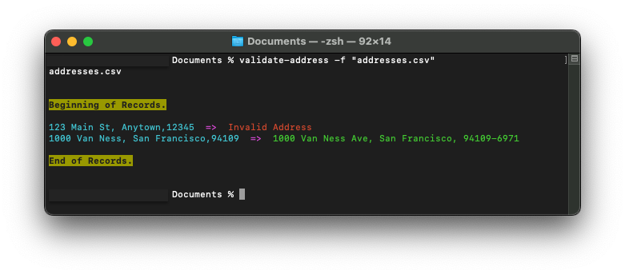

# validate-address-cli

An open-source command-line interface program that validates US addresses from a .csv file. The information is validated using a third-party API (https://www.smarty.com) and will require a valid user account at smarty.com.


## How to Install
Clone the repository into your local machine.

Install all required dependencies.
```bash
  npm install -g
```

Install the application.
```bash
  npm run build
```
Ensure that you grant read/write access to the application otherwise, an error may occur (permission denied).

If you encounter this error, run the command below from the repository's root directory to update permission and grant read/write access to the program. Click [here](https://www.educative.io/answers/how-to-resolve-the-permission-denied-error-in-linux) here for more information regarding user permissions.
 ```
 chmod 744 "dist/index.js"
 ```
 
## Environment Variables

To run this program, you will need to create an `.env` file in the repository's root directory and add the following environment variables to your `.env` file. These are the smarty.com API credentials. A valid user account is required.
```
AUTH_ID: [authentication id]
AUTH_TOKEN: [authentication token]
```
Obtain API credentials from https://www.smarty.com.

## How to Use
Ensure that you have a valid `.csv` file. File must have the following headers (Street, City, Zip Code) and no table name. The file must have at least one address to be validated.

example.csv
```csv
Street,City,Zip Code
123 Any Street,Anytown,12345
```

Using your terminal, navigate to the `.csv` file location. Then run this command.
```bash
validate-address -f "example.csv"
```

The results will be displayed on the terminal. If a valid address is entered, the validated adress will be displayed, otherwise, "Invalid Address" will be displayed.


For additional usage options, run this command (help option).
```bash
validate-address -h
```


## Running Tests

To run tests, run the following command

```bash
  npm test
```


## Considerations

In writing the program, I decided to use two primary NPM packages that made the application easier to organize and expand on its features. The `commander` npm package makes it easy to add additional options or functionality into the program and the `smartystreets-javascript-sdk` or smarty.com SDK provides custom features that are specific to its API. 

At first, I was going to use an additional NPM to handle data parsing, however upon reading the smarty.com API docs, I found that there is no need for a bulky .csv parser because the smarty.com API features a freeform entry where it reads addresses from a single string input.

The application were written into separate modules to make it easier to test and maintain. The program is flexible enough to handle any possible changes (ie. replacing the smarty.com API with another service) or adding new options or functionality. I used Typescript to ensure strict typing and to maintain readability.

The `index.ts` file consolidates the command options where it calls the specific function to run based on the option selected. Currently, the program is designed to verify US addresses only using the option `-f` to indicate the .csv file to be verified. It is very easy to add and implement additional options.
## Author

- Kris Magat [@krismagat](https://www.github.com/KrisMagat)


## Feedback

If you have any feedback, please reach out to us at kmag.usb@gmail.com

